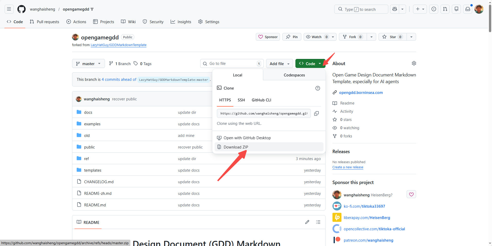
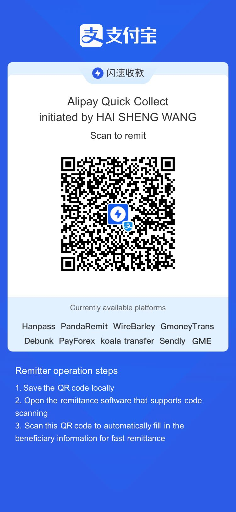

# Game Design Document (GDD) Master Template（游戏设计文档总模板）

本目录包含一套结合 Voodoo、原神（米哈游）、腾讯等大厂公开分享资料整理的 GDD 模板。
该模板启发自 https://github.com/LazyHatGuy/GDDMarkdownTemplate ，并结合我过往一年多的 vibe coding 探索与多年积累的游戏分析文章行业认知，形成面向 AI agents 的 Open Game Design Document Markdown Template。
每个章节为一个独立 Markdown 文件，可单独放入 Wiki 或文档系统中使用，避免传统 PDF/Word 形式在协作与迭代上的限制。

## 作者与链接
- 网站：https://opengdd.borninsea.com/
- X：https://x.com/edwin_uestc
- GitHub：https://github.com/wanghaisheng
- LinkedIn：https://www.linkedin.com/in/wanghaisheng/

- 1_Copyright Information.md —— 版权与法律信息
- 2_Version History.md —— 文档版本与审批记录
- 3_Game Overview.md —— 游戏概述与产品定义
- 4_Gameplay and Mechanics.md —— 核心玩法与系统机制
- 5_Story, Setting and Character.md —— 世界观与角色设定
- 6_Levels.md —— 关卡与内容结构
- 7_Interface.md —— 界面与交互系统
- 8_Artificial Intelligence.md —— 人工智能设计
- 9_Technical.md —— 技术方案与架构
- 10_Game Art.md —— 美术风格与资源规划
- 11_Secondary Software.md —— 配套工具与二级软件
- 12_Management.md —— 项目管理与运营规划
- 13_Appendices.md —— 附录与资产清单

## 如何下载所有文档

  

## GDD 交付物结构指南
- [GDD_Deliverable_Structure.md](templates/guides/gdd_deliverable_structure.md) —— 游戏设计文档交付物标准目录结构说明
- [Idea_to_Playable_Workflow.md](templates/guides/idea_to_playable_workflow.md) —— 从创意到试玩广告的全流程指南

> 建议：在立项初期先完成 3、4、9 章的「最小可行版本」，随后逐步补全其它章节。

## 更新说明（资产规范增补）

- 新增「资产管线与命名规范」：见 [10_Game Art](docs/10_Game%20Art.md) 的 10.10 章节。
- 更新「格式维度与选型」说明：见 [10_Game Art](docs/10_Game%20Art.md) 的 Format 维度与选型要点。
- 新增「资产路线图与通俗术语映射」：见 [13_Appendices](docs/13_Appendices.md) 的 13.5、13.6 章节。
- 新增「资产元数据与自动化校验」：见 [9_Technical](docs/9_Technical.md) 的 9.12、9.13 章节。
- 资产清单模板文件位置：templates/  
  - [asset_list_template.csv](templates/asset_list_template.csv)  
  - [asset_list_template.md](templates/asset_list_template.md)  
  - [asset_metadata_schema.json](templates/asset_metadata_schema.json)
  - 特定资产模板（抽卡展示动画）：  
    - [gacha_animation_spec.md](templates/gacha_animation_spec.md)  
    - [gacha_animation_storyboard.md](templates/gacha_animation_storyboard.md)  
    - [gacha_animation_metadata_schema.json](templates/gacha_animation_metadata_schema.json)
  - 视频资产模板（通用）：  
    - [video_asset_guide.md](templates/guides/video_asset_guide.md)  
    - [video_storyboard_template.md](templates/video_storyboard_template.md)  
    - [video_asset_metadata_schema.json](templates/video_asset_metadata_schema.json)  
    - [video_encoding_profiles.csv](templates/video_encoding_profiles.csv)
  - 序列帧指南：  
    - [image_sequence_guide.md](templates/guides/image_sequence_guide.md)
  - 资产提取说明：  
    - [asset_extraction_guide.md](templates/guides/asset_extraction_guide.md)
  - 通用分镜方法论：  
    - [universal_storyboard_method.md](templates/guides/universal_storyboard_method.md)
  - 镜头分解说明（按载体）：  
    - 视频资产：[storyboard_for_video_assets.md](templates/guides/storyboard_for_video_assets.md)  
    - 序列帧资产：[storyboard_for_image_sequence_assets.md](templates/guides/storyboard_for_image_sequence_assets.md)
  - API 驱动视频生产：  
    - [api_video_generation_guide.md](templates/guides/api_video_generation_guide.md)
  - 格式生产指南：  
    - 图片（image）：[image_asset_production_guide.md](templates/guides/image_asset_production_guide.md)  
    - 精灵表（sprite_sheet）：[sprite_sheet_production_guide.md](templates/guides/sprite_sheet_production_guide.md)  
    - 3D 模型（3d_model）：[3d_model_production_guide.md](templates/guides/3d_model_production_guide.md)  
    - 音频（audio）：[audio_asset_production_guide.md](templates/guides/audio_asset_production_guide.md)  
    - 粒子/特效（fx_particle）：[fx_particle_production_guide.md](templates/guides/fx_particle_production_guide.md)  
    - UI 元素（ui_element）：[ui_element_production_guide.md](templates/guides/ui_element_production_guide.md)
  - 特效讨论：  
    - [vfx_discussion.md](templates/guides/vfx_discussion.md)
  - 试玩广告（Playable Ad）：  
    - [playable_ad_video_guide.md](templates/guides/playable_ad_video_guide.md)
  - MVP 游玩预渲染视频：  
    - [mvp_gameplay_video_guide.md](templates/guides/mvp_gameplay_video_guide.md)

## 支持方式
- PayPal：https://www.paypal.com/ncp/payment/BAGUNNTYE9R76
- 支付宝（中国）：
  
  
- 支付宝（国际）：
  
  
- 微信支付（中国）：
  
  