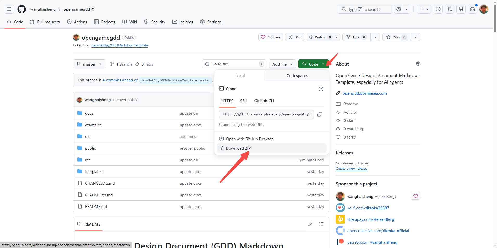

# Open Game Design Document (GDD) Markdown Template (for AI agents)

there are 3 pack under OpenAgenticGame 

## ai game studio

https://github.com/wanghaisheng/OpenAgenticGame-Studios 

## gdd generator based BMAD method

https://github.com/wanghaisheng/BMad-Expansion-Pack-game-gdd-generator

This folder contains an **Industrial Game Design System** designed to work well with AI agents and modern version-control workflows.

It is inspired by https://github.com/LazyHatGuy/GDDMarkdownTemplate and shaped by over a year of vibe coding exploration plus years of accumulated industry analysis and game design research, incorporating advanced design concepts from TiMi Studio Group, miHoYo, Tencent, and "Concentration Theory".

Each chapter is a standalone Markdown file that can live in a wiki or docs system, avoiding the collaboration and iteration limitations of traditional PDF/Word GDDs.

## 🚀 Major Upgrade Highlights

### 🎯 Industrial Design System
- **Planning Refinement Framework**: 6 major refinement modules including skills, missions, numerical design, monetization, narrative, and system architecture
- **Core Thrill Loop Design**: Complete design framework based on "Concentration Theory"
- **World-building Design Toolkit**: Based on TiMi Studio Group's industrial experience
- **AI-Assisted Design System**: Integrated AI tools for design decision support

### 🎮 Game Type Specialization
- **8 Major Game Type Adaptations**: Action, RPG, Strategy, Card, Simulation, Puzzle, Idle, Dating Sim
- **Based on Game Classification Data**: Covering 95%+ of market game types
- **Mixed Type Support**: Flexible module selection and mechanism fusion

### 📊 Quantified Evaluation System
- **Weight Allocation System**: Gameplay Logic 15%, Narrative Coherence 10%, System Architecture 5%
- **Scientific Scoring Standards**: Specific evaluation metrics and checklists for each module
- **Data-Driven Design**: Design guidance based on real market data

### 🌍 Internationalization Support
- **Bilingual Version Sync**: Completely corresponding Chinese and English versions
- **Cross-National Team Collaboration**: Adaptable to different regional development habits
- **Global Applicable Standards**: Meeting international major studio design standards

## Author & Links
- Website: https://opengdd.borninsea.com/
- X: https://x.com/edwin_uestc
- GitHub: https://github.com/wanghaisheng
- LinkedIn: https://www.linkedin.com/in/wanghaisheng/

## 📚 Documentation Structure (15-Chapter Complete System)

### 🎯 Core Design Chapters
- **3_Game Overview.md** — Product definition and overview
  - Added 3.1.1 Core Thrill Loop Design [Weight 8%]
- **4_Gameplay and Mechanics.md** — Core gameplay and systems
  - Refactored 4.2.7.2 Game Type-Based System Architecture Design
  - Enhanced commercial layered design system
- **5_Story, Setting and Character.md** — World, narrative, and characters
  - Refactored to 5.1 World-building Design Toolkit [Weight 6%]

### 🔧 Technical & Implementation Chapters
- **9_Technical.md** — Technical architecture and constraints
  - Added 9.1 System Architecture Design System [Weight 5%]

### 🤖 AI & Innovation Chapters
- **14_AI-Assisted Design.md** — AI-assisted design system [NEW]
  - Fun Concentration Tester Integration
  - World-building AI Assistant
  - Design Quality AI Assessment

### 🎮 Type Adaptation Chapters
- **15_Game Type Adaptation.md** — Game type adaptation module [NEW]
  - 8 major game type specialized adaptations
  - Mixed type handling mechanisms

### 📋 Basic Chapters
- **1_Copyright Information.md** — Copyright and legal information
- **2_Version History.md** — Versioning and approvals
- **6_Levels.md** — Levels and content structure
- **7_Interface.md** — UI/UX and interaction
- **8_Artificial Intelligence.md** — AI design
- **10_Game Art.md** — Art direction and asset planning
- **11_Secondary Software.md** — Tooling and secondary software
- **12_Management.md** — Production, operations, and management
- **13_Appendices.md** — Appendices and asset index

## 🎯 Usage Recommendations

### 📋 Minimum Viable Version (MVP)
It's recommended to complete the following chapters' MVP in the early stages:
1. **3_Game Overview** - Including core thrill loop design
2. **4_Gameplay and Mechanics** - Including game type adaptation
3. **9_Technical** - Including system architecture design

### 🔄 Iteration Process
1. **Phase 1**: Complete core design chapters (3, 4, 9)
2. **Phase 2**: Supplement world-building and AI design (5, 14)
3. **Phase 3**: Perfect type adaptation and evaluation (15)
4. **Phase 4**: Complete other chapters and appendices

### 🎮 Game Type Selection
Choose corresponding adaptation modules based on project type:
- **Action Games**: Select action game adaptation module
- **RPG Games**: Select RPG game adaptation module
- **Card Games**: Select card game adaptation module
- **Mixed Types**: Reference mixed type handling principles

## 📖 Related Guides

### 🎯 Design Guides
- [Planning Refinement Framework Integration Guide](templates/guides/enhanced_gdd_structure_integration.md)
- [Game Type Adaptation Guide](docs/en/15_Game%20Type%20Adaptation.md)
- [AI-Assisted Design Usage Guide](docs/en/14_AI-Assisted%20Design.md)

## 🎯 Key Features

### 🤖 AI-Empowered Design
- **Fun Concentration Tester**: AI analysis tool based on concentration theory
- **World-building AI Assistant**: Automated world-building design support
- **Design Quality Assessment**: AI-driven quality checks and optimization suggestions

### 📊 Data-Driven
- **Quantified Evaluation System**: Scientific scoring standards and weight allocation
- **Type Specialization**: Design guidance based on real market data
- **Balance Verification**: Systematic numerical balance checks

### 🌍 Industrial Standards
- **Modular Design**: Clear system division and relationships
- **Process Standardization**: Complete workflow from design to implementation
- **Quality Assurance**: Multi-level evaluation and verification mechanisms

## 🔄 Update History

### Latest Version Features
- ✅ **Core Thrill Loop Design**: Complete design framework based on concentration theory
- ✅ **World-building Design Toolkit**: Industrial world-building design system
- ✅ **AI-Assisted Design System**: Integrated artificial intelligence tools
- ✅ **Game Type Adaptation**: 8 major game type specialized guidance
- ✅ **Commercial Layered Design**: Complete user layered strategy
- ✅ **System Architecture Refactoring**: Game type-based design methods

### Technical Upgrades
- 🔄 **WBS Method Refactoring**: From project management methods to game design theory methods
- 🔄 **Module Universality**: Solving universality issues of specific modules
- 🔄 **Evaluation System**: Establishing scientific quantified evaluation standards
- 🔄 **Internationalization Sync**: Complete correspondence between Chinese and English versions

## 📥 How to download all files

  

## Deliverable Structure Guides
- [GDD_Deliverable_Structure.md](templates/guides/gdd_deliverable_structure.md) — Standard directory structure for GDD deliverables
- [Idea_to_Playable_Workflow.md](templates/guides/idea_to_playable_workflow.md) — End-to-end workflow from idea to a playable ad

> Recommendation: During greenlight, complete a minimal viable set of chapters 3, 4, and 9 first, then expand the rest iteratively.

---

**🚀 Start using this industrial game design system now and create your next successful game!**

## Updates (Asset Pipeline Additions)
- Added asset pipeline and naming conventions: see section 10.10 in [10_Game Art](docs/10_Game%20Art.md)
- Updated format taxonomy and selection guidance: see the “Format” dimension in [10_Game Art](docs/10_Game%20Art.md)
- Added asset roadmap and plain-language mapping: see sections 13.5 and 13.6 in [13_Appendices](docs/13_Appendices.md)
- Added metadata and automated validation guidance: see sections 9.12 and 9.13 in [9_Technical](docs/9_Technical.md)
- Asset template files are under templates/
  - [asset_list_template.csv](templates/asset_list_template.csv)
  - [asset_list_template.md](templates/asset_list_template.md)
  - [asset_metadata_schema.json](templates/asset_metadata_schema.json)
  - Gacha reveal templates
    - [gacha_animation_spec.md](templates/gacha_animation_spec.md)
    - [gacha_animation_storyboard.md](templates/gacha_animation_storyboard.md)
    - [gacha_animation_metadata_schema.json](templates/gacha_animation_metadata_schema.json)
  - Video asset templates
    - [video_asset_guide.md](templates/guides/video_asset_guide.md)
    - [video_storyboard_template.md](templates/video_storyboard_template.md)
    - [video_asset_metadata_schema.json](templates/video_asset_metadata_schema.json)
    - [video_encoding_profiles.csv](templates/video_encoding_profiles.csv)
  - Image sequence guide
    - [image_sequence_guide.md](templates/guides/image_sequence_guide.md)
  - Asset extraction guide
    - [asset_extraction_guide.md](templates/guides/asset_extraction_guide.md)
  - Universal storyboard method
    - [universal_storyboard_method.md](templates/guides/universal_storyboard_method.md)
  - Shot breakdown guides by medium
    - Video: [storyboard_for_video_assets.md](templates/guides/storyboard_for_video_assets.md)
    - Image sequence: [storyboard_for_image_sequence_assets.md](templates/guides/storyboard_for_image_sequence_assets.md)
  - API-driven video production
    - [api_video_generation_guide.md](templates/guides/api_video_generation_guide.md)
  - Production guides by format
    - Image: [image_asset_production_guide.md](templates/guides/image_asset_production_guide.md)
    - Sprite sheet: [sprite_sheet_production_guide.md](templates/guides/sprite_sheet_production_guide.md)
    - 3D model: [3d_model_production_guide.md](templates/guides/3d_model_production_guide.md)
    - Audio: [audio_asset_production_guide.md](templates/guides/audio_asset_production_guide.md)
    - FX/particles: [fx_particle_production_guide.md](templates/guides/fx_particle_production_guide.md)
    - UI element: [ui_element_production_guide.md](templates/guides/ui_element_production_guide.md)
  - VFX discussion
    - [vfx_discussion.md](templates/guides/vfx_discussion.md)
  - Playable ad guide
    - [playable_ad_video_guide.md](templates/guides/playable_ad_video_guide.md)
  - MVP gameplay pre-render video guide
    - [mvp_gameplay_video_guide.md](templates/guides/mvp_gameplay_video_guide.md)

## Support
- PayPal: https://www.paypal.com/ncp/payment/BAGUNNTYE9R76
- Alipay (China):
  
  
- Alipay (International):
  
  
- WeChat Pay (China):
  
  
